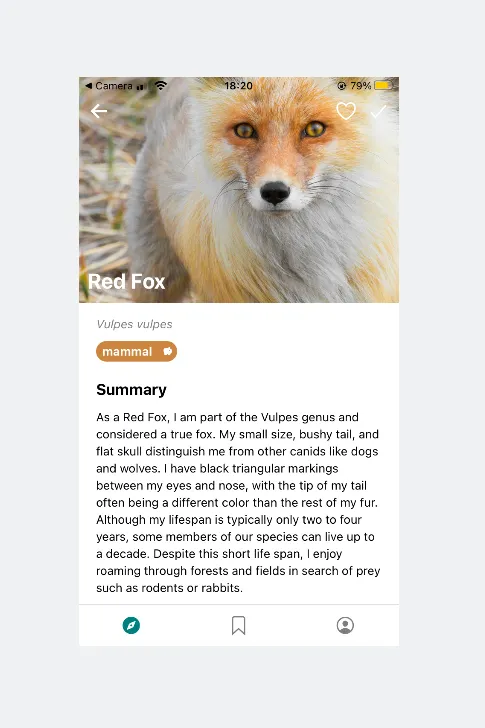

🦊 GPT-3 Wildlife Descriptions 🌍
Generate captivating descriptions for animals using OpenAI GPT and Wikipedia.

🔗 For an in-depth walk-through, check out this [Medium article](https://medium.com/@tigistznabei/how-i-used-openais-gpt-api-to-generate-compelling-descriptions-from-the-eyes-of-animals-de9126b85169).
While this codebase offers a practical implementation, be informed that it has been updated since I wrote the medium article. You can read the medium article for more info on the decision-making process and nuances of using the GPT API.

📜 Table of Contents
- [Overview](#overview)
- [Features](#features)
- [Setup & Usage](#setup--usage)
- [Structure of species.json](#structure-of-speciesjson)
- [Costs and API Key](#costs-and-api-key)
- [Updates & Changes](#updates--changes)
- [Contributing](#contributing)
- [License](#license)

### Overview
This project offers a streamlined method to generate compelling and human-like descriptions for various animal species. Utilizing OpenAI's GPT-3 and the reliable information from Wikipedia, this code produces descriptions that are not only factually accurate but also interesting to read.

Example description generated for a Red Fox:



### Features
- Intelligent Text Generation: Transform factual Wikipedia data into engaging content using GPT-3.
- Asynchronous Processing: Concurrently generate descriptions for a multitude of animals.
- Easy Setup: Initiate with a simple species.json file. If desired, you can upgrade to fetching from and writing to a database.
- Environment Management: Store your OpenAI API key securely in a .env file.

### Setup & Usage
1. Ensure you have Python 3.7+ installed.
2. Install the required packages: `pip install -r requirements.txt`
3. Populate the species.json with the desired animals.
4. Store your OpenAI API key in a .env file.
5. Run the main script: `python main.py`

```python
import asyncio
import os
import openai
from dotenv import load_dotenv

load_dotenv()
openai.api_key = os.getenv("OPENAI_API_KEY")

async def get_gpt_description(animal_name):
    # ... Rest of the function ...

async def main(animal_name_list):
    tasks = []
    for animal_name in animal_name_list:
        tasks.append(get_gpt_description(animal_name))
    await asyncio.gather(*tasks)

if __name__ == "__main__":
    animal_name_list = ['Lion', 'Tiger', 'Wolf']
    asyncio.run(main(animal_name_list))
```

### Structure of species.json
The species.json file should follow this structure:

```python
[
    {
        "species_id": 1,
        "genus": "Panthera",
        "species": "leo",
        "common_name": "Lion"
    },
    {
        "species_id": 2,
        "genus": "Panthera",
        "species": "tigris",
        "common_name": "Tiger"
    },
    {
        "species_id": 3,
        "genus": "Canis",
        "species": "lupus",
        "common_name": "Wolf"
    }
]
```

### Costs and API Key
Using the OpenAI GPT API isn't free. Check the current pricing details on OpenAI's official website. This code assumes you have a valid OpenAI GPT API key. Store this key in a .env file as OPENAI_API_KEY.
